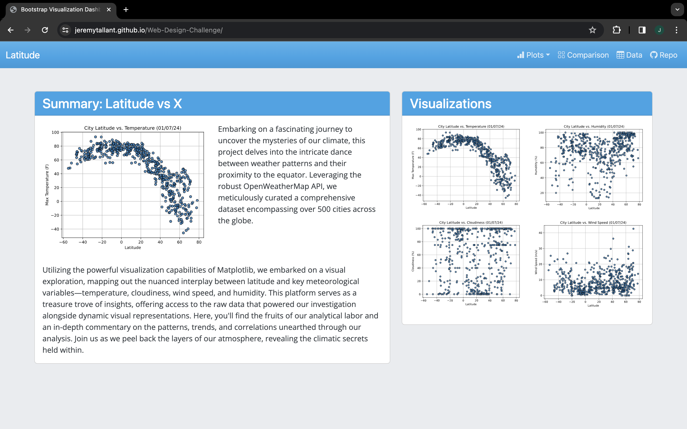

# Web-Based Weather Explorer

## Background
In data-driven decision-making, the transformative power of data is unleashed when it becomes accessible to a broader audience. Recognizing this, the Web-Based Weather Explorer project aims to democratize data access through innovative web technologies. This initiative focuses on developing a web-based dashboard visually analyzing weather patterns across different latitudes, leveraging HTML and CSS for its construction. The project emphasizes the importance of data visualization in understanding complex datasets, offering users an intuitive and interactive platform to explore the Global Weather Trends Analysis. By meticulously organizing the project's structure into specific folders for assets, resources, and visualizations and deploying the dashboard via GitHub Pages, this project showcases the technical prowess of web design and champions the cause of making data more approachable and insightful for all. Through a series of visualization pages, a comprehensive comparisons page, and a data-centric page, the project serves as a testament to the power of collaborative and open access to data.
[https://jeremytallant.github.io/Web-Design-Challenge/](https://jeremytallant.github.io/Web-Design-Challenge/)