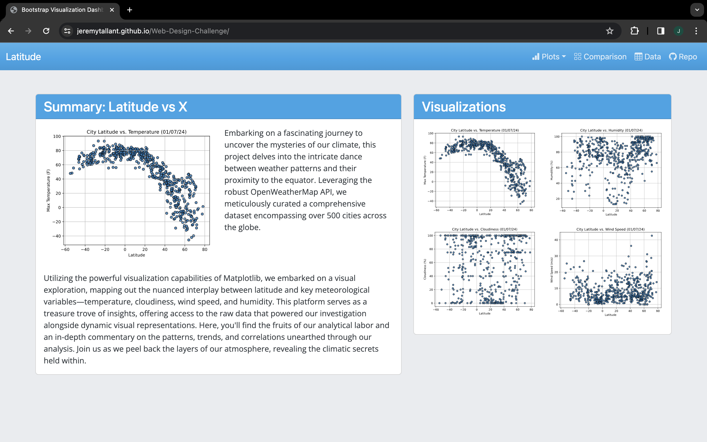

# Web-Based Weather Explorer

## Background
In data-driven decision-making, the transformative power of data is unleashed when it becomes accessible to a broader audience. Recognizing this, the Web-Based Weather Explorer project aims to democratize data access through innovative web technologies. This initiative focuses on developing a web-based dashboard visually analyzing weather patterns across different latitudes, leveraging HTML and CSS for its construction. The project emphasizes the importance of data visualization in understanding complex datasets, offering users an intuitive and interactive platform to explore the Global Weather Trends Analysis. By meticulously organizing the project's structure into specific folders for assets, resources, and visualizations and deploying the dashboard via GitHub Pages, this project showcases the technical prowess of web design and champions the cause of making data more approachable and insightful for all. Through a series of visualization pages, a comprehensive comparisons page, and a data-centric page, the project serves as a testament to the power of collaborative and open access to data.

**Explore the dashboard here**: [Web-Based Weather Explorer Dashboard](https://jeremytallant.github.io/Web-Design-Challenge/)

## Table of Contents
- [Objective](#objective)
- [Data](#data)
- [Features](#features)
- [Technologies Used](#technologies-used)
- [Project Structure](#project-structure)
- [Usage](#usage)
## Objective
The primary objective of the Web-Based Weather Explorer project is to design and implement an interactive dashboard that provides comprehensive insights into how weather variables change across different latitudes around the globe. By utilizing web technologies such as HTML, CSS, and Bootstrap, this project aims to create an accessible and user-friendly platform where users can engage with and analyze weather data through visualizations and comparisons. The dashboard will feature a variety of pages, each dedicated to a specific aspect of weather analysis, including temperature, humidity, cloudiness, and wind speed, among others. Additionally, the project seeks to demonstrate the power of data visualization in making complex data sets understandable and engaging for a broad audience. Through this interactive dashboard, users will gain a deeper understanding of global weather patterns, fostering greater awareness and curiosity about the natural world.
## Data
The dataset powering the Web-Based Weather Explorer dashboard is housed in a pivotal file named `cities.csv`, a product of an advanced script developed for the "Global Weather Trends Analysis" project. This script skillfully fetched and compiled detailed weather data from the OpenWeatherMap API, encapsulating vital weather metrics across diverse latitudes into this single comprehensive file. The `cities.csv` file forms the project's backbone, underpinning both the original analytical work and the interactive visualizations central to the dashboard. Through this structured dataset, the dashboard facilitates an immersive exploration of global weather patterns, offering users a direct window into the intricate ways geographic location impacts weather phenomena, all made accessible and engaging through the dashboard's dynamic visual presentations.
## Features
The Web-Based Weather Explorer Dashboard is designed to provide an immersive and interactive experience for users interested in understanding global weather patterns. Here's a breakdown of the key features that make this dashboard a valuable resource for weather analysis:
* **Interactive Visualizations**: Each weather parameter (such as temperature, humidity, cloudiness, and wind speed) is represented through dynamic charts and graphs. These visualizations allow users to explore how weather conditions vary across different latitudes.
* **Responsive Design**: Built with Bootstrap, the dashboard is fully responsive, ensuring a seamless experience on devices of all sizes, from desktops to smartphones.
* **Global Weather Data**: The dashboard leverages a comprehensive dataset compiled from the OpenWeatherMap API, providing up-to-date and historical weather data from cities across different latitudes.
* **Comparative Analysis**: A dedicated comparisons page lets users view all main visualizations side by side, facilitating easy comparison of weather trends across different geographic locations.
* **Data Accessibility**: An interactive table on the data page displays the underlying dataset used for the visualizations, allowing users to delve into the specifics of the weather data.
* **Navigation Bar**: A custom Bootstrap navigation bar at the top of every page enhances user navigation, offering quick access to all dashboard sections, including the home page, individual visualizations, the comparison page, and the data page.
* **Custom Styling**: Beyond Bootstrap's default styling, custom CSS is applied for unique visual enhancements, improving the dashboard's overall aesthetics and user interface.
* **GitHub Pages Deployment**: The dashboard is hosted on GitHub Pages, providing easy and reliable access to the project's latest version for anyone with an internet connection.

These features collectively ensure that the Web-Based Weather Explorer Dashboard is a tool for visualizing weather data and an educational resource for understanding the impact of geographic location on weather patterns.
## Technologies Used
The Web-Based Weather Explorer Dashboard leverages a combination of modern web development technologies and data analysis tools to provide a rich user experience and insightful visualizations. Below is a list of the critical technologies and frameworks that play a crucial role in the development and operation of the dashboard:
* **HTML5**: Used as the backbone of the dashboard, HTML5 enables the structuring of web content, ensuring that the dashboard's layout is well-organized and semantically correct.
* **CSS3**: Cascading Style Sheets (CSS3) are utilized for styling the dashboard. Custom styles alongside Bootstrap components create a visually appealing and intuitive user interface.
* **Bootstrap**: This open-source toolkit is used for developing with HTML, CSS, and JS. Bootstrap provides a responsive grid system, prebuilt components, and powerful plugins, making the dashboard responsive and accessible on any device.
* **jQuery**: A fast, small, and feature-rich JavaScript library. It simplifies HTML document traversal and manipulation, event handling, and animation.
* **Pandas (Python)**: Utilized for data manipulation and analysis; the project's dataset was prepared and analyzed using Pandas. The to_html method in Pandas was beneficial for converting the data into HTML tables for the data page.
* **Git:** Used for version control, Git allows for efficient project source code management, enabling collaborative development and easy tracking of changes.
* **GitHub Pages**: Provides a hosting service that allows the dashboard to be deployed directly from the GitHub repository to the web, making it publicly accessible.

These technologies were chosen for their reliability, scalability, and wide adoption in the web development community, ensuring that the Web-Based Weather Explorer Dashboard is built on a solid foundation that can evolve.
## Project Structure
This section provides a detailed overview of the repository structure for the Web-Based Weather Explorer Dashboard, ensuring that users can navigate and understand the layout of each file and directory.
```plaintext
Web-Design-Challenge
│
├── assets/                     
│   ├── css/                    
│   │   ├── bootstrap.min.css   
│   │   └── styles.css          
│   │
│   └── images/                 
│       ├── fig1.svg            
│       ├── fig2.svg            
│       ├── fig3.svg            
│       ├── fig4.svg            
│       └── homepage.png        
│
├── visualizations/            
│   ├── cloudiness.html         
│   ├── humidity.html           
│   ├── temp.html               
│   └── wind.html               
│
├── comparison.html             
├── data.html                   
├── index.html                  
└── README.md                   
```
## Usage
The Web-Based Weather Explorer Dashboard is designed to be intuitive and user-friendly, allowing anyone interested in global weather patterns to navigate and interact with the data easily. Here’s how to make the most of the dashboard:

### Navigating the Dashboard
* **Landing Page**: Start exploring the landing page, where you’ll find an overview of the project and links to all other dashboard sections. This page serves as the gateway to the various visualizations and analyses available.
* **Visualization Pages**: Each visualization page focuses on weather parameters such as cloudiness, humidity, temperature, and wind speed. Navigate to these pages using the links provided on the landing page or through the navigation bar at the top of every page.
	* **Cloudiness**: Explore patterns of cloud coverage across different latitudes.
	* **Humidity**: Analyze humidity trends around the world.
	* **Temperature**: View how temperatures vary as a function of latitude.
	* **Wind Speed**: Examine global wind speed variations.
* **Comparison Page**: This page allows you to compare all visualizations side by side, offering a comprehensive view of how different weather parameters change with latitude.
* **Data Page**: To dive deeper into the numbers behind the visualizations, visit the data page. Here, you’ll find a responsive table displaying the dataset used for the dashboard’s visualizations.
### Interacting with Visualizations
* **Responsive Design**: The dashboard is fully responsive, ensuring a seamless device experience. Resize your browser window or access the dashboard from a mobile device to see the layout adjust automatically for optimal viewing.
### Navigation Bar
* The navigation bar is a constant feature on every page, making switching between different dashboard sections easy. It includes:
	* **Home Link**: Click on the site’s name or logo on the left to return to the landing page anytime.
	* **Plots Dropdown**: Access individual visualization pages directly from the dropdown menu named "Plots."
	* **Comparisons and Data Links**: Quickly jump to the comparisons or data page with one click.


